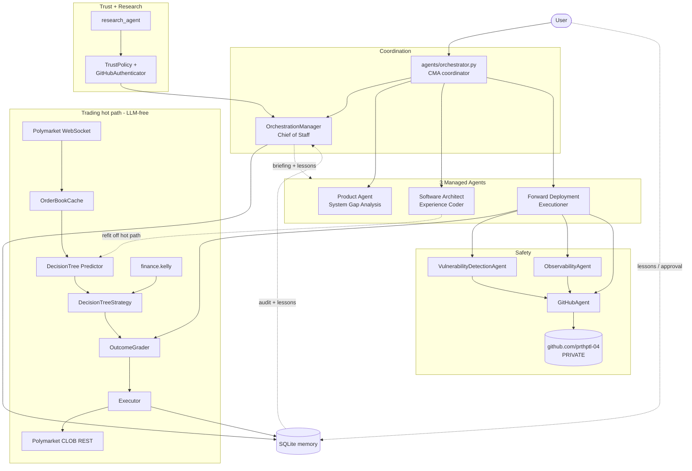
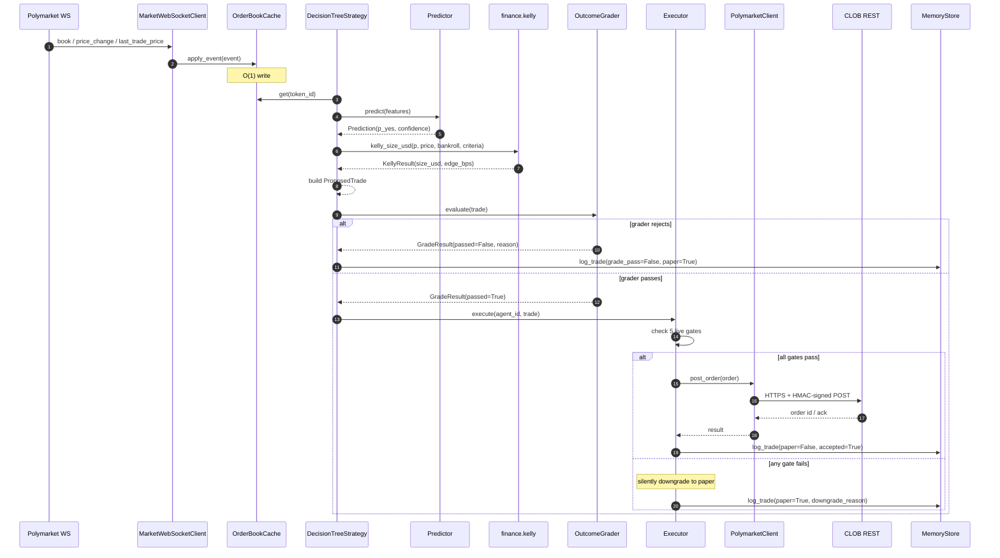
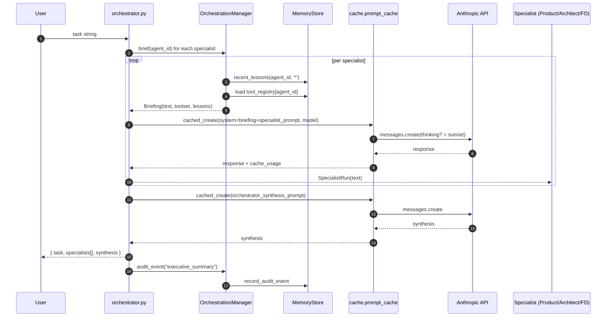
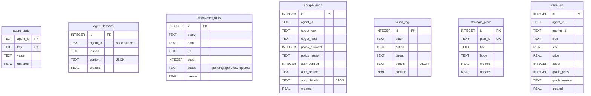
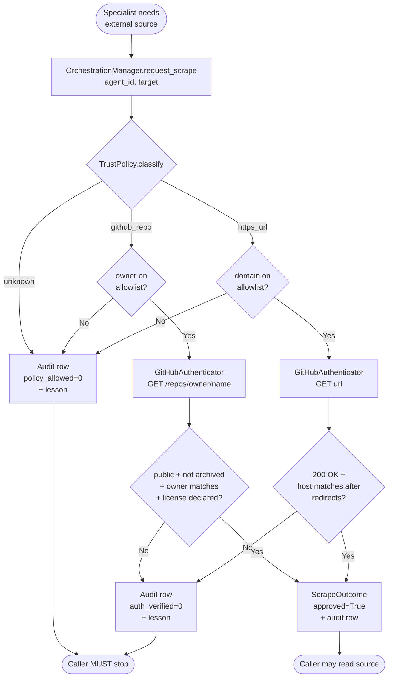
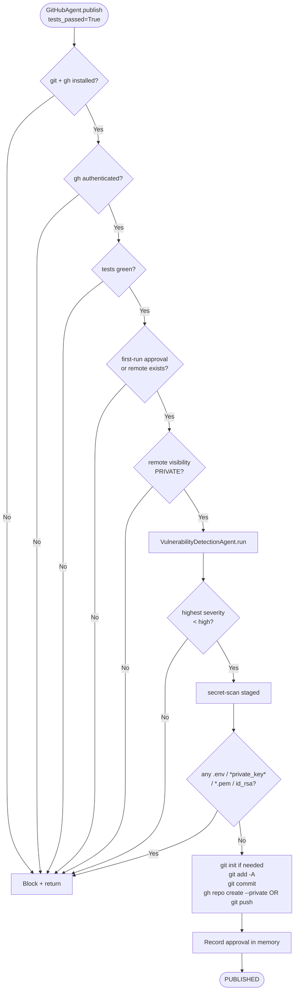
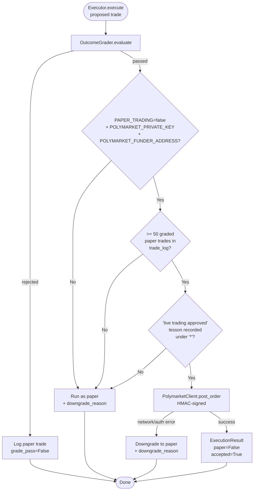
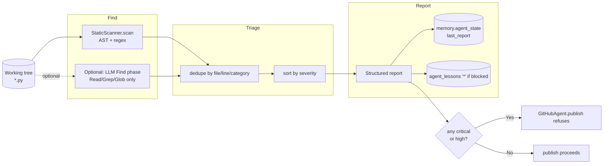
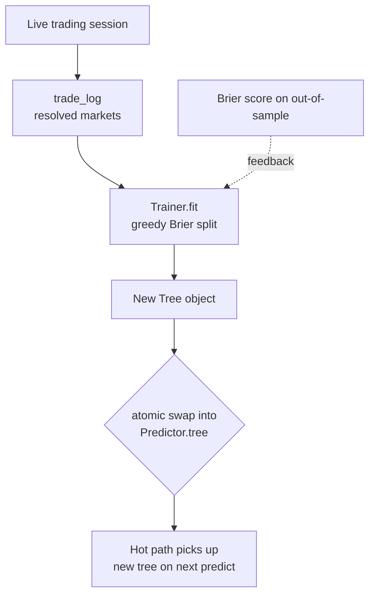

# Low-Level Design — Lazy Polymarket Trader

Single source of truth for how the service is wired. Read top-to-bottom for
new contributors; jump by section when you know what you're looking for.

Last updated: 2026-05-13. The diagrams use Mermaid (renders natively on GitHub).

---

## Table of contents

1. [System overview](#1-system-overview)
2. [Component inventory](#2-component-inventory)
3. [Architecture diagram](#3-architecture-diagram)
4. [Trading hot path (sequence)](#4-trading-hot-path-sequence)
5. [Agent orchestration (sequence)](#5-agent-orchestration-sequence)
6. [Memory schema (ERD)](#6-memory-schema-erd)
7. [Trust-gated scraping (flowchart)](#7-trust-gated-scraping-flowchart)
8. [Publish-gate (flowchart)](#8-publish-gate-flowchart)
9. [Live-flip checklist (flowchart)](#9-live-flip-checklist-flowchart)
10. [Vulnerability scan workflow](#10-vulnerability-scan-workflow)
11. [Decision-tree training loop](#11-decision-tree-training-loop)
12. [Concurrency + threading model](#12-concurrency--threading-model)
13. [Failure modes + recovery](#13-failure-modes--recovery)
14. [Cross-cutting policies](#14-cross-cutting-policies)
15. [Configuration surface](#15-configuration-surface)
16. [Glossary](#16-glossary)

---

## 1. System overview

The service is an autonomous Polymarket trading bot. Three Claude-driven
"managed agents" (Product, Architect, Forward Deployment) cooperate through
an Orchestrator + Orchestration Manager (Chief of Staff). Below them sit
deterministic modules that do the actual trading work — sub-millisecond
on the hot path, with the LLM held off the per-tick path entirely.

Design tenets:

- **LLM is never in the trading loop.** Agents plan and refit between trades;
  trading itself is deterministic Python.
- **Every action that crosses a trust boundary is gated and audited.**
  Scraping, publishing, live execution — all have multiple-condition checks
  recorded to memory.
- **Paper-trading is the default.** Live trading requires five independent
  conditions; downgrade-to-paper is the safe fallback for every failure.
- **The same memory + audit layer serves agents and humans.** Lessons,
  decisions, plans, scrapes are durable across sessions.

---

## 2. Component inventory

| Layer | Module | What it does |
|-------|--------|--------------|
| Agents | [agents/orchestrator.py](../agents/orchestrator.py) | CMA coordinator. Routes a task to 1–3 specialists; synthesizes. |
| Agents | [agents/orchestration_manager.py](../agents/orchestration_manager.py) | Chief of Staff. Briefs specialists with skills + lessons, gates scraping, persists plans, audits, surfaces executive summaries. |
| Agents | [agents/{product,architect,forward_deployment}_agent.py](../agents/) | Three Claude specialists with distinct system prompts and ownership boundaries. |
| Agents | [agents/tool_registry.py](../agents/tool_registry.py) | Declarative registry of skills + Python tools available per specialist. |
| Skills | [.claude/skills/system-architect/SKILL.md](../.claude/skills/system-architect/SKILL.md) | Architecture decision-tree + safety model. |
| Skills | [.claude/skills/web-scraper/SKILL.md](../.claude/skills/web-scraper/SKILL.md) | yfe404/web-scraper (MIT). Recon + scraping strategy. Trust-gated. |
| Skills | [.claude/skills/financial-applications/SKILL.md](../.claude/skills/financial-applications/SKILL.md) | Polymarket binary-market math (Kelly, Brier, Sharpe, VaR, drawdown). |
| Skills | [.claude/skills/vulnerability-detector/SKILL.md](../.claude/skills/vulnerability-detector/SKILL.md) | POLY-001..POLY-011 categories tuned to this bot. |
| Skills | [.claude/skills/research-agent/SKILL.md](../.claude/skills/research-agent/SKILL.md) | Trust-gated research façade. |
| Skills | [.claude/skills/observability/SKILL.md](../.claude/skills/observability/SKILL.md) | Read-only health monitoring. |
| Skills | [.claude/skills/tool-evaluation/SKILL.md](../.claude/skills/tool-evaluation/SKILL.md) | Regression harness for deterministic tools. |
| Skills | [.claude/skills/extended-thinking/SKILL.md](../.claude/skills/extended-thinking/SKILL.md) | Auto-enable thinking budget on Sonnet. |
| Memory | [memory/store.py](../memory/store.py) + [schema.sql](../memory/schema.sql) | SQLite. Tables: `agent_state`, `agent_lessons`, `discovered_tools`, `scrape_audit`, `audit_log`, `strategic_plans`, `trade_log`. |
| Cache | [cache/prompt_cache.py](../cache/prompt_cache.py) | Mandatory wrapper around Anthropic Messages API. Cache-tags system prompts; auto-enables thinking on Sonnet. |
| Trading | [trading/polymarket_client.py](../trading/polymarket_client.py) | L1→L2 auth, HMAC-signed order submission. |
| Trading | [trading/strategies.py](../trading/strategies.py) | `DecisionTreeStrategy` (cache → features → tree → Kelly → grader). |
| Trading | [trading/execution.py](../trading/execution.py) | The five-gate live-trading executor. |
| Trading | [trading/browser_fallback.py](../trading/browser_fallback.py) | Headed browser-use for wallet-connect flows. |
| Live data | [live_market/orderbook_cache.py](../live_market/orderbook_cache.py) | O(1) in-memory orderbook. |
| Live data | [live_market/websocket_client.py](../live_market/websocket_client.py) | Async subscriber to Polymarket market channel. |
| Live data | [live_market/rest_snapshot.py](../live_market/rest_snapshot.py) | Initial-state seeder. |
| Prediction | [decision_tree/features.py](../decision_tree/features.py) | Feature extraction from `OrderBook`. |
| Prediction | [decision_tree/tree.py](../decision_tree/tree.py) | In-memory tree (no sklearn). |
| Prediction | [decision_tree/predictor.py](../decision_tree/predictor.py) | Hot-path predictor with confidence. |
| Prediction | [decision_tree/trainer.py](../decision_tree/trainer.py) | Greedy Brier-split trainer. |
| Finance | [finance/kelly.py](../finance/kelly.py) | Kelly sizing on binary markets. |
| Finance | [finance/risk_metrics.py](../finance/risk_metrics.py) | Brier, max-drawdown, Sharpe, VaR. |
| Finance | [finance/pnl.py](../finance/pnl.py) | P&L reconstruction from `trade_log`. |
| Verification | [verification/criteria.py](../verification/criteria.py) | Risk caps + live-flip constants. |
| Verification | [verification/outcome_grader.py](../verification/outcome_grader.py) | The deterministic gate every trade must pass. |
| Trust gate | [web_scraper/trust_policy.py](../web_scraper/trust_policy.py) | Allowlist of trusted GitHub owners + domains. |
| Trust gate | [web_scraper/authenticator.py](../web_scraper/authenticator.py) | GitHub REST + HTTPS authenticity probe. |
| Research | [research_agent/agent.py](../research_agent/agent.py) | Trust-gated research façade. |
| Observability | [observability/agent.py](../observability/agent.py) | Composed health report (gh + pytest + LiveFeedback). |
| Observability | [observability/github_health.py](../observability/github_health.py) | `gh repo view` parsing. |
| Observability | [observability/test_health.py](../observability/test_health.py) | pytest summary parser. |
| Tool eval | [tool_evaluation/harness.py](../tool_evaluation/harness.py) + [cases.py](../tool_evaluation/cases.py) | Exact-match regression for deterministic helpers. |
| Vuln detector | [vulnerability_detector/static_scanner.py](../vulnerability_detector/static_scanner.py) | AST + regex scanner over POLY categories. |
| Vuln detector | [vulnerability_detector/agent.py](../vulnerability_detector/agent.py) | Find → Triage → Report pipeline. |
| Publishing | [github_publisher/agent.py](../github_publisher/agent.py) | Deterministic publish gate. |
| Publishing | [github_publisher/git_ops.py](../github_publisher/git_ops.py) | git + gh wrappers. |
| Monitoring | [monitoring/live_feedback.py](../monitoring/live_feedback.py) | Ring buffer of runtime feedback events. |
| Product | [product/gap_analysis.py](../product/gap_analysis.py) + [roadmap.md](../product/roadmap.md) | Gap-ticket detection from recurring feedback. |

---

## 3. Architecture diagram

---

## 4. Trading hot path (sequence)

This is what happens between a WebSocket frame arriving and an order being submitted. No Claude API calls — everything is pure Python.

End-to-end budget (typical):

| Step | Time |
|------|------|
| WS event → cache update | ~50 µs |
| Feature extraction | ~10 µs |
| Tree predict | ~5 µs |
| Strategy propose + Kelly | ~30 µs |
| Grader evaluate | ~5 µs |
| **Local decision total** | **~100 µs** |
| HMAC signing + HTTPS POST | 50–150 ms (network-bound) |

---

## 5. Agent orchestration (sequence)

When the user asks a question that needs specialist input, the orchestrator routes it through the OrchestrationManager and synthesizes the responses.

---

## 6. Memory schema (ERD)

All durable state lives in one SQLite file at `MEMORY_DB_PATH` (default `./memory/state.db`).

These tables are **append-only or upsert-only** by convention; we never `DELETE`. The audit trail is the source of truth for post-hoc analysis.

---

## 7. Trust-gated scraping (flowchart)

Every external read — research, tool discovery, anything that crosses the network — funnels through this single gate.

Result of every call is durable in `scrape_audit` regardless of outcome.

---

## 8. Publish-gate (flowchart)

`GitHubAgent.publish` only writes to the PRIVATE GitHub repo when ALL six conditions are satisfied.

The vulnerability scan and the secret scan are independent — the secret scan checks the staged file set; the vuln scan reads the working tree.

---

## 9. Live-flip checklist (flowchart)

This is the only way a real order reaches Polymarket. Five independent conditions, all checked per call by `_live_preconditions`.

The "downgrade to paper" path is the safe failure mode. The executor **never** raises into the strategy on a live-side issue — strategy keeps running on paper and the issue is recorded for FD to triage.

---

## 10. Vulnerability scan workflow

Modeled on the cookbook 06 Find → Triage → Report pattern. The deterministic core always runs; the LLM Find phase only runs when `ANTHROPIC_API_KEY` is set AND `VULN_LLM_PHASE=1`.

POLY-001..POLY-011 categories are defined in [categories.py](../vulnerability_detector/categories.py). Severity floor for blocking publish is `high`.

---

## 11. Decision-tree training loop

The hot path uses an in-memory tree. Agents refit the tree off the hot path, on a cadence the user controls.

Hyperparameters (max_depth=4, min_samples_leaf=5) live in code, not memory.
Replacing them is a code review event, not a config flag.

---

## 12. Concurrency + threading model

The bot runs as a **single asyncio event loop**:

- `MarketWebSocketClient.run()` is the producer — one coroutine per market channel subscription.
- Strategy + executor are async-friendly but synchronous in their hot path.
- `MemoryStore` uses sqlite3 with a single shared connection — Python's sqlite3 is thread-safe in serialized mode by default.
- Anthropic SDK calls (for orchestration / agent invocation) happen on a separate task off the trading event loop; they do not contend with trading writes.

**There is no multi-threading.** If we ever need true parallelism (e.g. multiple market subscriptions running in different OS threads), add an `asyncio.Lock` per token to the `OrderBookCache` and migrate `MemoryStore` to a connection pool. The README's roadmap parks this as a Phase-3 concern.

---

## 13. Failure modes + recovery

| Failure | Detection | Recovery |
|---------|-----------|----------|
| Polymarket CLOB 5xx | `_with_retry` in `PolymarketClient` | Exponential backoff 250ms → 4s, 5 attempts; then raise. |
| WebSocket disconnects | `MarketWebSocketClient.run` returns | Caller restarts; cache stays warm so next book event refreshes it. |
| `gh` not authenticated | `gh_authenticated()` returns False | `GitHubAgent.publish` refuses; user runs `gh auth login`. |
| Grader rejects | `GradeResult.passed=False` | Trade logged as paper with `grade_pass=False`; lesson recorded. |
| Live submit fails | `Exception` from `post_order` | Downgrade to paper, set `downgrade_reason`, emit `wallet_sign_failed` feedback. |
| Vuln scan blocks | `Report.blocked_publish=True` | Publish refuses; specialist fixes finding before retry. |
| Trust gate rejects scrape | `ScrapeOutcome.approved=False` | Caller MUST stop; rejection becomes a lesson for the agent. |
| Memory db unwritable | sqlite raises | Service crashes loud — DO NOT silently continue. |
| Anthropic API error | `cached_create` raises | Orchestrator stops the current task; caller retries. |

Crash-safety: every mutation is committed before the next decision. There is no "in-flight order" window — the order id is logged before submit returns.

---

## 14. Cross-cutting policies

Documented in [CLAUDE.md](../CLAUDE.md):

1. **Agent ownership** — directories are owned by specific specialists; cross-lane edits must route through the orchestrator. Static scanner flags violations (POLY-003).
2. **Production Managed Cache** — every Anthropic call goes through `cache.prompt_cache.cached_create`. No exceptions.
3. **Verification gate** — pytest + outcome grader must both be green before any phase is marked done.
4. **Paper-trading default** — five conditions to flip live.
5. **Secrets** — `.env` is gitignored; never logged, never committed.
6. **Skill consultation** — `.claude/skills/system-architect/SKILL.md` is consulted before new integrations.
7. **Orchestration Manager briefing** — every specialist run sees its tools + recent lessons prepended.
8. **Trust-gated scraping** — `OrchestrationManager.request_scrape` for every external read.
9. **Private-only GitHub publishing** — `GitHubAgent` refuses non-private repos.
10. **Vulnerability scan** — gates every publish.
11. **Position sizing** — must go through `finance.kelly`.
12. **Cookbook patterns** — research, observability, tool-eval, extended-thinking each have a documented skill.
13. **Live-flip checklist** — codified in `_live_preconditions`.
14. **Real-time data + tree on the hot path** — LLM never per-tick.

---

## 15. Configuration surface

### `.env` (gitignored; template at [.env.example](../.env.example))

| Var | Required when | Default |
|-----|---------------|---------|
| `ANTHROPIC_API_KEY` | Any LLM call (orchestrator, research, vuln-LLM-phase) | (unset) |
| `POLYMARKET_PRIVATE_KEY` | Signed CLOB calls | (unset) |
| `POLYMARKET_FUNDER_ADDRESS` | Signed CLOB calls with signature_type 1/2/3 | (unset) |
| `POLYMARKET_SIGNATURE_TYPE` | Always (defaults to 3) | `3` |
| `POLYMARKET_CHAIN_ID` | Always (defaults to 137) | `137` |
| `POLYMARKET_CLOB_HOST` | Always (defaults to mainnet) | `https://clob.polymarket.com` |
| `PAPER_TRADING` | Always; live requires `false` | `true` |
| `MEMORY_DB_PATH` | Optional override | `./memory/state.db` |
| `VULN_LLM_PHASE` | Optional; set `1` to enable LLM Find phase | `1` |

### `verification/criteria.py`

| Constant | Default | Effect |
|----------|---------|--------|
| `max_position_usd` | `10.0` | Hard cap per trade; grader rejects oversize |
| `max_daily_loss_usd` | `20.0` | Daily kill-switch (declared; enforcement is on the roadmap) |
| `min_orderbook_depth_usd` | `500.0` | Refuses thin-book trades |
| `max_slippage_bps` | `50` | Refuses trades where strategy's slippage estimate is too high |
| `min_expected_edge_bps` | `20` | Refuses low-edge trades |
| `MIN_PAPER_TRADES_FOR_LIVE` | `50` | Paper-trade gate before live |
| `LIVE_APPROVAL_LESSON` | `"live trading approved"` | Exact string the user records under `'*'` to enable live |

### `.claude/settings.json`

Permission allowlist for `Bash` / `Read` / `Write` / `Edit` on this project.

---

## 16. Glossary

- **L1 / L2 (Polymarket)** — L1 is the EOA private-key signer (one signature derives the L2 creds); L2 is the HMAC-SHA256 layer used on every CLOB request.
- **Funder** — The address that holds USDC collateral. For signature_type=3 it's a deposit wallet distinct from the signer EOA.
- **CMA** — Coordinate Managed Agents (cookbook pattern). Our `agents/orchestrator.py` is a direct port.
- **POLY-NNN** — Vulnerability category id (see `vulnerability_detector/categories.py`).
- **Half-Kelly** — Default Kelly multiplier `0.5`. Reduces variance vs full Kelly at the cost of some long-run growth.
- **Verified Outcome** — The grader's "passed=True" status. A necessary precondition for any execution (paper or live).
- **Lane** — A specialist's owned directory set. Crossing without going through the orchestrator is a POLY-003 finding.
- **Briefing** — The skill list + recent lessons that `OrchestrationManager.wrap_system_prompt` prepends to a specialist's system prompt.
